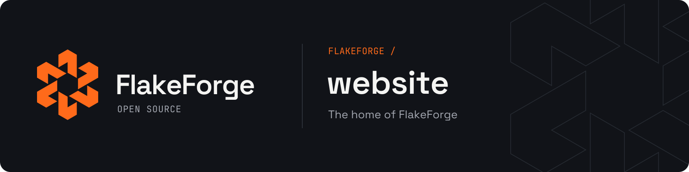
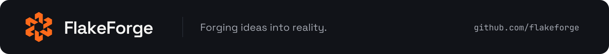

<p align="center">
  
</p>

<p align="center">
  <a href="https://flakeforge.com">flakeforge.com</a>
</p>

<p align="center">
  
  
  
  
  
  
</p>

The site of FlakeForge, a studio that builds web apps, mobile apps, and Telegram bots and publishes its own tools as open source. It holds the client offer, case studies for our projects, and a blog, in English, Russian, and Uzbek.

## What is inside

- Statically generated pages for every locale, served by the Next.js standalone server in Docker.
- Light and dark themes that follow the OS, with a manual switch and no flash on load.
- Scroll-driven motion with GSAP and Lenis: a pinned service stack, a horizontal project gallery, split-line headlines. Everything falls back to a still page with `prefers-reduced-motion`.
- An MDX blog and case studies. English is required; a missing translation falls back to English, and the blog can hide posts that are not translated.
- A contact form that sends briefs to a Telegram chat through a Server Action.
- Per-post Open Graph images, RSS per locale, a sitemap with hreflang alternates.

`IDEA.md` explains the product and the design decisions. `AGENTS.md` holds the code rules for people and coding agents.

## Stack

| Concern         | Tool                                                                                                    |
| --------------- | ------------------------------------------------------------------------------------------------------- |
| Framework       | [Next.js 16](https://nextjs.org) App Router, React 19, TypeScript strict                                |
| Styling         | [Tailwind CSS v4](https://tailwindcss.com) with semantic tokens and `light-dark()`                      |
| Primitives      | [Base UI](https://base-ui.com)                                                                          |
| Motion          | [GSAP](https://gsap.com) (ScrollTrigger, SplitText) and [Lenis](https://lenis.darkroom.engineering)     |
| i18n            | [next-intl](https://next-intl.dev)                                                                      |
| Content         | [MDX](https://mdxjs.com) with Shiki highlighting through `rehype-pretty-code`                           |
| Architecture    | [Feature-Sliced Design](https://feature-sliced.design)                                                  |
| Lint and format | [oxlint](https://oxc.rs/docs/guide/usage/linter) and [oxfmt](https://oxc.rs/docs/guide/usage/formatter) |

## Requirements

- Node.js 24
- pnpm 11
- [just](https://just.systems) (`brew install just`)

## Getting started

```bash
just install
cp .env.example .env
just dev
```

Open [localhost:3000](http://localhost:3000). The root path redirects to `/en`. Run `just` to see every recipe.

| Recipe                | What it does                                                  |
| --------------------- | ------------------------------------------------------------- |
| `just dev`            | Dev server                                                    |
| `just check`          | Format check, lint (type-aware), `tsc`, and unused-code check |
| `just fmt`            | Format with oxfmt, including import and Tailwind class order  |
| `just doctor`         | React health scan with react-doctor                           |
| `just lighthouse`     | Build and run Lighthouse CI on the key pages                  |
| `just ci`             | Everything above plus a production build                      |
| `just post <slug>`    | Scaffold a draft blog post                                    |
| `just project <slug>` | Scaffold a draft case study                                   |
| `just docker-run`     | Build and run the production image on port 8080               |

## Project structure

```txt
content/          MDX posts and case studies, one file per locale
messages/         UI strings for en, ru, uz
src/
  app/            routes, layouts, providers
  modules/        one folder per page
  widgets/        header, footer, and other large blocks
  features/       contact form, locale and theme switchers, blog filter
  entities/       post and project UI
  shared/         design system, lib, config, styles
assets/           README banners from the brand kit
```

## Environment

| Variable               | Purpose                                                                  |
| ---------------------- | ------------------------------------------------------------------------ |
| `NEXT_PUBLIC_SITE_URL` | Canonical origin for metadata, the sitemap, and RSS. Read at build time. |
| `TELEGRAM_BOT_TOKEN`   | Bot that receives contact form briefs                                    |
| `TELEGRAM_CHAT_ID`     | Chat the bot posts to                                                    |

Without the Telegram variables the site still works, and the contact form asks visitors to write by email.

## Writing content

```bash
just post my-first-post
```

This creates `content/blog/my-first-post/en.mdx` as a draft. Drafts show up in `just dev` and stay out of production builds until you set `draft: false`. Add `ru.mdx` or `uz.mdx` next to it when the translation is ready. Frontmatter is validated at build time, so a missing title or a malformed date fails the build instead of shipping.

Case studies work the same way with `just project <slug>` under `content/work/`.

## Tooling

| Tool                                                           | Config               | Job                                                  |
| -------------------------------------------------------------- | -------------------- | ---------------------------------------------------- |
| [oxlint](https://oxc.rs/docs/guide/usage/linter)               | `.oxlintrc.json`     | Linting, including type-aware rules through tsgolint |
| [oxfmt](https://oxc.rs/docs/guide/usage/formatter)             | `.oxfmtrc.json`      | Formatting, import order, Tailwind class order       |
| [lefthook](https://lefthook.dev)                               | `lefthook.yml`       | Git hooks                                            |
| [react-doctor](https://react.doctor)                           | `doctor.config.json` | React health scan                                    |
| [knip](https://knip.dev)                                       | `knip.json`          | Unused files, exports, and dependencies              |
| [Lighthouse CI](https://github.com/GoogleChrome/lighthouse-ci) | `lighthouserc.json`  | Performance, accessibility, and SEO budgets          |

In VS Code, install the recommended Oxc extension (`oxc.oxc-vscode`). The workspace settings already point formatting and fixes at it.

## Contributing

Hooks install with the dependencies. On commit, lefthook formats and lints the staged files. Before a push, it runs `typecheck` and `knip`.

Commit messages follow [Conventional Commits](https://www.conventionalcommits.org): `feat(blog): add tag pages`, `fix(contact): trim telegram handle`. Run `just check` before opening a pull request.

## Docker

```bash
just docker-run
```

This builds the image with `NEXT_PUBLIC_SITE_URL` from `.env` (or `https://flakeforge.com`) and runs it with `.env` when the file exists. The image runs the Next.js standalone server on port 8080 as a non-root user.

## License

[MIT](./LICENSE)

<p align="center">
  
</p>
